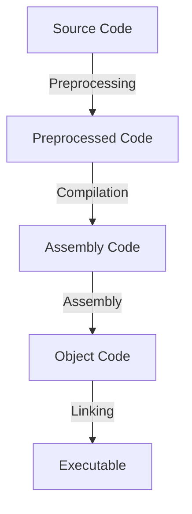

**Computer Fundamentals, Computer Architecture, and GCC Toolchain**, followed by your **GitHub details** at the end. 🚀  

---

# 📌 **Computer Fundamentals, Computer Architecture, and GCC Toolchain**  

## 📖 **1. Computer Fundamentals**  

### 🔹 **What is a Computer?**  
A **computer** is an electronic device that processes data to perform tasks. It takes input, processes it, stores information, and produces output.  

### 🔹 **Basic Computer Operations**  
1. **Input** → Data is given to the computer (e.g., keyboard, mouse).  
2. **Processing** → The CPU processes the data.  
3. **Storage** → Data is saved in memory (RAM, Hard Drive).  
4. **Output** → Results are displayed (Monitor, Printer).  
5. **Control** → Instructions are executed in sequence.  

### 🔹 **Real-Life Analogy**  
💡 **Computer as a Kitchen**  
- **Input Devices (Ingredients)** → Keyboard, Mouse (Vegetables, Spices)  
- **Processor (Chef)** → CPU (Processes food)  
- **Memory (Storage)** → RAM (Chopping Board for temporary work)  
- **Output Devices (Dish Served)** → Monitor, Speaker  

---

## 📖 **2. Computer Architecture**  

### 🔹 **Basic Components of a Computer**  
1. **Central Processing Unit (CPU)** → The "brain" of the computer  
2. **Memory (RAM & Storage)** → Stores data temporarily or permanently  
3. **Input/Output Devices** → Allows user interaction  
4. **Bus System** → Transfers data between components  

### 🔹 **Von Neumann Architecture**  
Most modern computers follow this model:  
- **CPU** (Control Unit + ALU)  
- **Memory** (RAM, Cache)  
- **I/O Devices** (Keyboard, Monitor)  
- **Single Memory for Data & Instructions**  

### 🔹 **Real-Life Analogy**  
💡 **CPU as a Factory**  
- **ALU (Arithmetic Logic Unit)** → Workers performing calculations  
- **Control Unit** → Manager directing operations  
- **Registers** → Small shelves for quick access items  
- **RAM** → Temporary workspace  

---

## 📖 **3. GCC Toolchain and Its Components**  

### 🔹 **What is GCC?**  
**GCC (GNU Compiler Collection)** is a set of tools used to compile and execute C programs. It translates source code into machine code.  

### 🔹 **Components of GCC Toolchain**  

| Component | Description | Command |
|-----------|------------|---------|
| **Preprocessor** | Handles macros, includes, and conditional compilation. | `gcc -E program.c -o program.i` |
| **Compiler** | Converts preprocessed code to assembly code. | `gcc -S program.i -o program.s` |
| **Assembler** | Translates assembly code into machine code. | `gcc -c program.s -o program.o` |
| **Linker** | Combines object files into an executable. | `gcc program.o -o program.out` |

### 🔹 **Compilation Process**  



### 🔹 **Real-Life Analogy**  
💡 **Building a House**  
- **Preprocessing (Blueprints)** → Includes instructions  
- **Compiling (Brick Making)** → Translates plans into physical materials  
- **Assembling (Construction)** → Builds the structure  
- **Linking (Finalizing)** → Adds doors, windows, and makes it livable  

### 🔹 **Example Code Compilation in GCC**  

#### 📌 **Basic Compilation**  
```bash
gcc program.c -o program
./program
```

#### 📌 **Step-by-Step Compilation**  
```bash
gcc -E program.c -o program.i  # Preprocessing
gcc -S program.i -o program.s  # Compilation
gcc -c program.s -o program.o  # Assembly
gcc program.o -o program        # Linking
./program                      # Running Executable
```

---

## 🔗 **GitHub Repository Details**  
**GitHub Repository Details** :  

- **Repo Name**: `C-Language`  
- **Owner**: [Abhishek Atole](https://github.com/Abhishek-Atole)  
- **GitHub Link**: [C-Language Repository](https://github.com/Abhishek-Atole/C-Language.git)  

