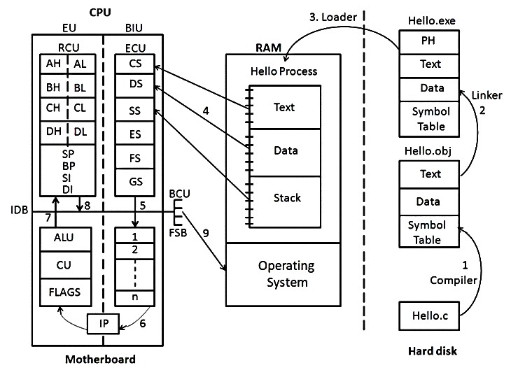

# **📌 x86 Toolchain - Overview**
The **x86 toolchain** is a set of tools used to build and execute programs on an **x86-based system**. It includes multiple stages, from writing the source code to executing the final compiled program.

---

## **🛠️ Components of the x86 Toolchain**
The **x86 toolchain** consists of four key components:

| **Component** | **Tool Used** | **Function** |
|--------------|-------------|-------------|
| **Compiler** | `gcc` (GNU Compiler) | Converts source code into assembly/object code. |
| **Assembler** | `as` (GNU Assembler) | Converts assembly into machine code (object file). |
| **Linker** | `ld` (GNU Linker) | Combines object files into an executable. |
| **Loader** | OS Loader | Loads the executable into memory for execution. |

---

## **📌 x86 Compilation Process**
The **x86 toolchain** follows **four steps**:  
1️⃣ **Compilation**  
2️⃣ **Assembly**  
3️⃣ **Linking**  
4️⃣ **Loading & Execution**  

Each step transforms the program into a machine-understandable format.

---

## **🔹 Step 1: Compilation**
💡 **Tool Used: GCC Compiler (`gcc`)**  

The **compiler** translates a **C program** into an **assembly file** (`.s` file).

⏩ **Example Command:**
```bash
gcc -S Hello.c -o Hello.s
```

📌 **Process:**  
- The C code is analyzed and optimized.  
- It is converted into **assembly language**.  

📌 **Example Code (`Hello.c`)**:
```c
#include <stdio.h>
int main() {
    printf("Hello, x86!\n");
    return 0;
}
```

📌 **Generated Assembly (`Hello.s` - x86 Assembly Output):**
```assembly
.section .text
.globl main
main:
    pushl %ebp
    movl %esp, %ebp
    subl $8, %esp
    pushl $.LC0
    call printf
    movl $0, %eax
    leave
    ret
```

---

## **🔹 Step 2: Assembly**
💡 **Tool Used: Assembler (`as`)**  

The assembler **converts assembly code into machine code** (**Object file: `.o`**).

⏩ **Example Command:**
```bash
as Hello.s -o Hello.o
```

📌 **Process:**  
- Converts **assembly code** into **machine instructions**.  
- The output is a **binary object file (`.o`)**.  

---

## **🔹 Step 3: Linking**
💡 **Tool Used: Linker (`ld`)**  

The **linker** takes the object file (`Hello.o`) and links it with libraries to create an **executable file (`Hello.exe`)**.

⏩ **Example Command:**
```bash
gcc Hello.o -o Hello.exe
```

📌 **Process:**  
- Merges **multiple object files**.  
- Resolves function/library references (`printf` is linked to `libc`).  
- Produces the final **executable file (`Hello.exe`)**.

---

## **🔹 Step 4: Loading & Execution**
💡 **Tool Used: Loader (Part of OS Kernel)**  

The **Loader** loads the executable into RAM and prepares it for execution.

⏩ **Execution Command:**
```bash
./Hello.exe
```

📌 **Process:**  
- The **OS loads the program** into **RAM**.  
- The **CPU executes instructions** from **RAM**.  

---

## **📌 Image Representation of the x86 Toolchain**


 


---

## **🔥 Summary of x86 Toolchain**
| **Step** | **Tool Used** | **Purpose** |
|----------|-------------|------------|
| **1️⃣ Compilation** | **GCC Compiler (`gcc`)** | Converts C code to Assembly (`.s`). |
| **2️⃣ Assembly** | **Assembler (`as`)** | Converts Assembly to Object File (`.o`). |
| **3️⃣ Linking** | **Linker (`ld`)** | Creates Executable (`.exe`). |
| **4️⃣ Loading & Execution** | **OS Loader, CPU** | Runs the Program in RAM. |


---

# **📌 GitHub Repository Details**  

📂 **Repo Name**: `C-Language`  
👤 **Owner**: [Abhishek Atole](https://github.com/Abhishek-Atole)  
🔗 **GitHub Link**: [C-Language Repository](https://github.com/Abhishek-Atole/C-Language.git)  


