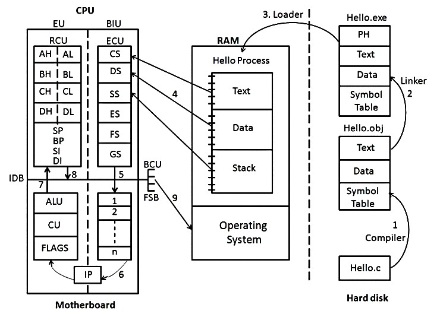

Yes! The process of writing, compiling, linking, and executing a C program follows a **12-step toolchain process** in an **x86 system**. Here's a **detailed breakdown** of each step:

---

## **🔥 The 12-Step Journey of a C Program Execution in x86 Architecture 🔥**  

### **📝 Step 1: Writing the Code (Source Code)**
- You write a C program in a text editor (e.g., VS Code, Notepad++, Vim) and save it with a **.c** extension.
- Example: `hello.c`
- **Analogy:** Writing a recipe before cooking. You must plan the steps first.

```c
#include <stdio.h>

int main() {
    printf("Hello, World!\n");
    return 0;
}
```

---

### **🛠️ Step 2: Preprocessing (Preprocessor)**
- The **preprocessor (`cpp`)** handles directives like `#include` and `#define`, expanding macros and including header files.
- **Output:** Generates an expanded source file (`hello.i`).
- **Analogy:** Before cooking, you gather ingredients and prepare them.

```c
// Before preprocessing
#include <stdio.h>

int main() {
    printf("Hello, World!\n");
    return 0;
}

// After preprocessing
// (Expands stdio.h and macros)
int main() {
    __builtin_printf("Hello, World!\n");
    return 0;
}
```

---

### **🔠 Step 3: Compilation (Compiler)**
- The compiler (`gcc`) translates the preprocessed file (`hello.i`) into assembly code (`hello.s`).
- **Analogy:** Converting a handwritten recipe into a structured, step-by-step guide.

```assembly
.section .rodata
.LC0:
    .string "Hello, World!"

main:
    pushq %rbp
    movq %rsp, %rbp
    movl $.LC0, %edi
    call puts
    popq %rbp
    ret
```

---

### **⚙️ Step 4: Assembling (Assembler)**
- The assembler (`as`) converts the assembly code (`hello.s`) into **machine code** (`hello.o`).
- **Output:** Object file (`hello.o`)—a binary but incomplete program.
- **Analogy:** Preparing ingredients but not yet cooking.

```bash
as hello.s -o hello.o
```

---

### **🔗 Step 5: Linking (Linker)**
- The **linker (`ld`)** links multiple object files and standard libraries (like `libc`) to create an executable (`hello.exe` or `a.out`).
- **Analogy:** Combining ingredients in a pot before cooking.

```bash
ld hello.o -o hello.exe
```

---

### **💾 Step 6: Storing the Executable (Hard Disk)**
- The **final executable** is stored in the system as `hello.exe` or `a.out`.
- **Analogy:** Storing cooked food in a container before serving.

```bash
./hello.exe
```

---

### **🧠 Step 7: Loading into RAM (Loader)**
- The **OS loader** loads the executable into **RAM**.
- It allocates memory for **code, data, stack, and heap**.
- **Analogy:** Taking food out of the container and putting it on a plate before eating.

---

### **💡 Step 8: CPU Fetching Instructions**
- The **CPU fetches** the first instruction (`main()`) from memory.
- **Analogy:** Taking the first bite of food.

---

### **⚡ Step 9: Decoding Instructions**
- The **CPU decodes** the fetched instruction (e.g., `printf("Hello, World!")`).
- **Analogy:** Your brain processes the food taste.

---

### **🚀 Step 10: Executing Instructions**
- The **CPU executes** the decoded instructions.
- In our case, it calls `printf()`, which **writes "Hello, World!" to the screen**.
- **Analogy:** Your body digesting food.

---

### **📞 Step 11: System Calls**
- The **OS handles system calls** (e.g., `write()` for printing).
- **Analogy:** Using cutlery to help you eat (an intermediary between food and mouth).

```assembly
mov $0x1, %rax  # syscall: write
mov $0x1, %rdi  # file descriptor (stdout)
mov $msg, %rsi  # message address
mov $13, %rdx   # message length
syscall         # invoke the system call
```

---

### **🏁 Step 12: Program Termination**
- The **program exits** after execution.
- **Analogy:** After finishing your meal, you clean the table.

```bash
echo $?
# 0 (successful execution)
```

---

## **🖼️ Image Representation of the x86 Toolchain**


---

## **🚀 Key Components of x86 Toolchain**
| Component       | Function |
|----------------|----------|
| **Preprocessor (`cpp`)** | Expands macros, removes comments, includes headers |
| **Compiler (`gcc`)** | Converts source code to assembly |
| **Assembler (`as`)** | Converts assembly to object code |
| **Linker (`ld`)** | Links object files into an executable |
| **Loader** | Loads the program into RAM |
| **CPU Execution** | Fetches, decodes, executes instructions |

---

### **🔥 Summary**
✅ The **12-step toolchain** is how a C program **transforms from source code to execution** in an x86 system.  
✅ Each step plays a critical role, ensuring **correct compilation, linking, and execution**.  
✅ **Real-life analogies** make it easy to understand each stage.

---

# **📌 GitHub Repository Details**  

📂 **Repo Name**: `C-Language`  
👤 **Owner**: [Abhishek Atole](https://github.com/Abhishek-Atole)  
🔗 **GitHub Link**: [C-Language Repository](https://github.com/Abhishek-Atole/C-Language.git)  


